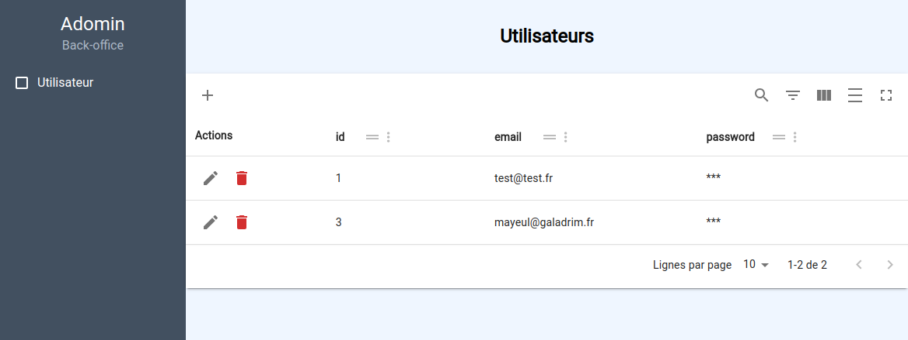

# Adomin

Adomin is a backoffice generator for Adonis it is composed of:

- backend files that will be imported on your adonis backend
- a react/vite frontend repository to clone

Adomin is for grown up people that are ready to **OWN** the code that they will download.
If you want a software with easy update, Adomin is **NOT** for you.
Adomin is meant to be used as a base for a quick and solid backoffice with the ability to add infinite customisations (you own the code)

## Install

```bash
yarn add --dev @galadrim/adomin
yarn add xlsx # needed for excel export
# if you don't need excel export, remove the excel export related code
```

## Install backend files

```
node ace configure @galadrim/adomin
```

- edit `package.json` and add `"#adomin/*": "./app/adomin/*.js"` inside the `"imports"` object

- edit `tsconfig.json` and add `"#adomin/*": ["./app/adomin/*.js"]` inside the `"paths"` object

- edit `start/routes.ts` : add this import statement to enable all of Adomin routes

```
import '#adomin/routes/adomin_router'
```

- check the content of `app/adomin/routes/adomin_router.ts` this is all the backend routes of Adomin, it's here that you can change things to restrict route access

- add some config inside `app/Adomin/CONFIG.ts`

```ts
const USER_CONFIG = createModelConfig(() => User, {
  label: 'Adominer',
  columns: {
    email: { type: 'string', isEmail: true, label: 'Super email' },
    password: { type: 'string', isPassword: true, label: 'Strong password' },
  },
})

export const ADOMIN_CONFIG: AdominConfig = {
  title: 'Adomin',
  models: [USER_CONFIG],
}
```

:bulb: Fields configurated inside the `columns` field will be shown on the admin frontend, additionnaly, the primary key field will be shown
(Adomin uses Lucid model primaryKey field to know which is the primary key)

:bulb: To show the primary key on the frontend, Adomin applies a default config to your primary key field:

```ts
const PRIMARY_KEY_DEFAULT_CONFIG: AdominNumberFieldConfig = {
  type: 'number',
  editable: false,
  creatable: false,
}
```

You can overwrite this config as you please (but I think you should keep creatable: false!)

- get the frontend

```
git clone https://github.com/galadrimteam/adomin-frontend.git
```

- edit the .env to point to your backend

```
VITE_API_URL=http://localhost:3333
```

- :tada:


